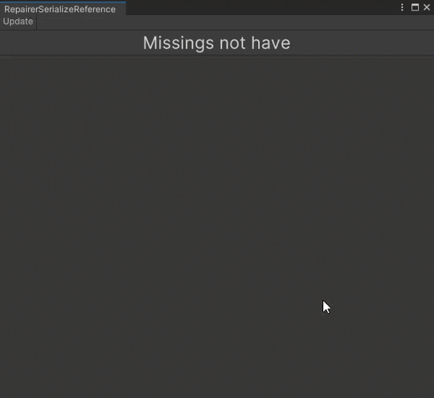

# RepairerSerializeReferences
Окно редактора для починки Serialize Reference после смены/переименования класса, сборки или пространства имён.

**Важно**: пока только с версии Unity 2021.2.

## Добавление в проект
Чтобы добавить данный пакет в проект, нужно выполнить следующие шаги:
1) Откройте PackageManager;
2) Выберите "Add package from get URL";
3) Вставьте ссылки на пакеты, которые являются зависимостями данного пакета:
    + `https://github.com/Paulsams/MiscUtilities.git`
4) Вставьте ссылку на данный пакет: `https://github.com/Paulsams/RepairerSerializeReferences.git`

## Зависимости
- Использует:
    + MicsUtilities: https://github.com/Paulsams/MiscUtilities.git

## Возможности
1) Можно просматривать каждую потерянную ссылку в индивидуальном порядке (как и в префабах, так и на сцене);
2) Позволяет починить все ссылки разом (переключатель "Update All");
3) Позволяет поменять только на тот тип, который существует в данной сборке и по данному пространству имён.

## Как использовать
Данное окно можно открыть в верхнем меню по пути `Window/RepairerSerializeReference`, а дальше нужно обязательно самому нажать кнопку "Update", а иначе никакого обновления не будет.
